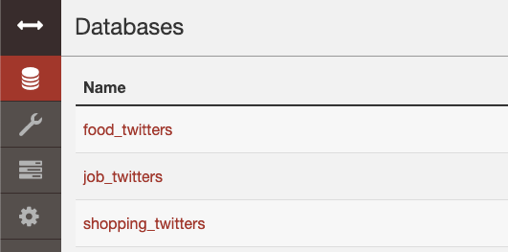

# Team 58 - Project  


This is the instruction to deploy our whole system, which including:  

- Cluster Configuration  
- Data Harvester End  
- Data Analysis Pipeline  
- CouchDB Cluster Backend  
- Web-based Visualization End  
  
We deployed a backup visulisation end which can be access by the link below (Only allow access in Unimelb or with Unimelb VPN): 

[Visulization Website](http://115.146.92.183/homepage.html)  


The figure below displays the architecture of the system, the details of the system is introduced in the final report. 

  

## Cluster Configuration (Ansible Playbook)   


## Data Harvest End  


## Data Analysis Pipeline  
The Data Analysis Pipeline requires to run on the "Display" instance. A local stand-alone CouchDB has to be configured on this instance.   
The NLTK (Natural Language Toolkit) and WordNet package for NLTK is required to be install prior.  

``` bash
$ pip3 install nltk  
$ python3  
``` 
``` python
import nltk
nltk.download('wordnet')
```

To run the Analysis Pipeline, just go to the Analysis folder and run script:

``` bash  
cd ${Project_path}/Analyze/  
chmod 777 process_all.sh  
./process_all.sh  
```  
The analysis script will automatically classify the data for different scenarios and do the sentiment analysis task. The processed twitters will be output to the local CouchDB:  
 

This part usually takes about 20 minutes to run.

## CouchDB Cluster Backend  
To populate the data to the CouchDB Cluster, compile and push MapReduce views, we build a script which can run all tasks automatically. 


## Web-based Visualization End  
The web visualization end will be automatically deployed by the Ansible Playbook. It just runs in the Docker Container on the same Nectar Cloud instance of the CouchDB master node. So there is no need to configure the web end manually. 


