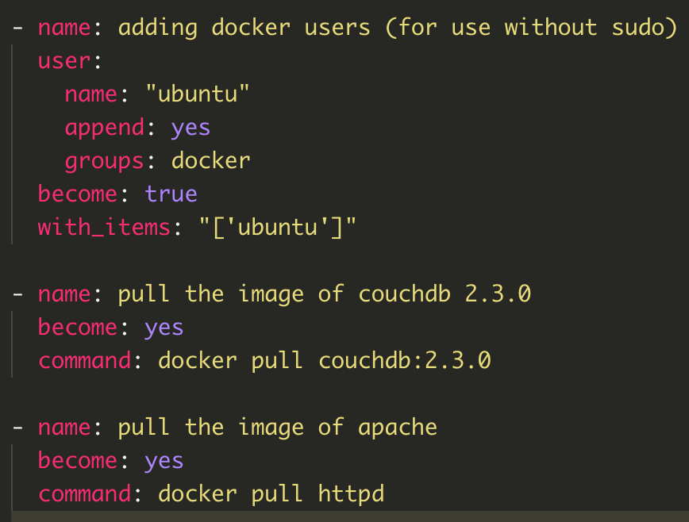
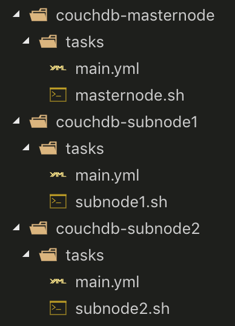
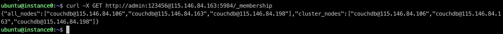
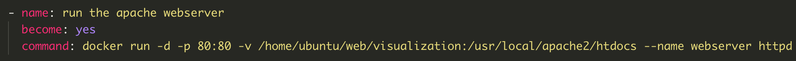

## Automation

### Introduction

In this assignment, we use Ansible to realize the function of automation. With one script, we can apply the instances from Nectar, then setup a CouchDB cluster among the virtual machines and make the webpage ready to run (but the databases are empty at this moment, to populate them, we need to log into the masternode server and run a bash script which is uploaded by Ansible).

### How to Work

We just need to execute **run.sh**, then input the password of openstack API and localhost, then the script will automatically complete the tasks mentioned above.

### Project Structure


```txt
├── Group58.pem
├── ansible.cfg
├── apply-instance.yml
├── background-configuration.yml
├── couchdb-cluster-setup.yml
├── docker-configuration.yml
├── environment-reset.yml
├── inventory.ini
├── openstack-api-password-Group58.txt
├── roles
│   ├── background-configuration
│   │   └── tasks
│   │       ├── data-populate.sh
│   │       └── main.yml
│   ├── couchdb-masternode
│   │   └── tasks
│   │       ├── main.yml
│   │       └── masternode.sh
│   ├── couchdb-subnode1
│   │   └── tasks
│   │       ├── main.yml
│   │       └── subnode1.sh
│   ├── couchdb-subnode2
│   │   └── tasks
│   │       ├── main.yml
│   │       └── subnode2.sh
│   ├── docker-configuration
│   │   └── tasks
│   │       └── main.yml
│   ├── openstack-common
│   │   └── tasks
│   │       └── main.yml
│   ├── openstack-images
│   │   └── tasks
│   │       └── main.yml
│   ├── openstack-instance
│   │   └── tasks
│   │       └── main.yml
│   ├── openstack-security-groups
│   │   └── tasks
│   │       └── main.yml
│   ├── reset
│   │   └── tasks
│   │       ├── main.yml
│   │       └── stop-containers.sh
│   ├── template-rendering
│   │   ├── tasks
│   │   │   └── main.yml
│   │   └── templates
│   │       ├── data-populate.sh.j2
│   │       ├── food_data.js.j2
│   │       ├── inventory.ini.j2
│   │       ├── job_data.js.j2
│   │       ├── masternode.sh.j2
│   │       ├── shopping_data.js.j2
│   │       ├── subnode1.sh.j2
│   │       └── subnode2.sh.j2
│   └── wait-for-port
│       └── tasks
│           └── main.yml
├── run.sh
├── unimelb-comp90024-group-58-openrc.sh
├── variables
│   └── variables.yml
└── web
    └── visualization
```

### Sepcific Process

1. Apply Instance
2. Render Templates
3. Install Docker
4. Setup CouchDB Cluster
5. Setup Apache Server

### Apply Instance

In this step, we reference the demo in Lecture 5, which shows how to use Ansible to apply one instance. We apply 3 instances in this assignment, set one instance as the masternode of CouchDB cluster and the other two as the subnodes. An exclusive instance(IP address is 115.146.92.183) has been applied in advance for harvast program, data collecting and visualization display.

#### Instance Variables

- Image: NeCTAR Ubuntu 16.04 LTS (Xenial) amd64 
- Flavor: m1.small
- Availability Zone: melbourne-qh2
- Security: We open the port 22 for ssh connection, port 80 for http access, and port 5984 for CouchDB's operations.

We set a task for the instances to wait 240 seconds since when they have been created. The reason why we do this is to ensure the enough time before the port 22 of each instance has been opened. If the waiting time is too short, the ssh connection to the virtual machines may fail.


And we solve the problem that if we use Ansible to connect serveral instances by ssh for the first time, the prompts from serveral virtual machines to the user to input "yes/no" will conflict to each other, then fail the connection. We create an **ansible.cfg** file in the playbook directory, which can skip the prompt when connect instances via ssh.


### Render Template

A very important step for the automation is that we need use some bash scripts to complete the operations. So we need put the IP address into these scripts. In addition, Ansible also need the IP address to tell which servers should complete the current tasks.


Since the floating IP address is allocated by the application of instances, we use some variables to record them and make some Jinja2 templates, after the applications of instance, the templates will be rendered as the real scripts, JavaScript codes and configuration files to relevant locations.


### Install Docker

We use Docker as a supporting tool in this assignment. The most useful characteristics of Docker is that we can reset the all the dependent environment of the image by killing the container, which is very convenient for developing. With the help of Docker, we do not need to uninstall the software or delete the instance repeatedly if the environment has been "messy", and it allows us to run multiple services on one host and avoid the conflict between them.

In this step, we reference the demo in Lecture 5, which shows how to launch a Wordpress service by Docker via Ansible. And for the later step, we add three tasks for every instances in this role: add docker users, pull the image of CouchDB, pull the image of Apache.



### Setup CouchDB Cluster

At first, we set up a demo of CouchDB cluster on two instances manually as a prototype, then extend it to 3 instances. At last, we try to use Ansible to complete the configuration of CouchDB cluster. Since we can use the bash scripts in the early steps, so our choice is to use Anisble unload the bash scripts to the database services, then execute them.



The order of the execution of these 3 scripts is described as follows: first we use Jinja2 templates to render the floating IP to the scripts and upload them to corresponding servers, then we start the scripts on the subnodes. After that, the script on masternode will be executed.

#### Docker Port Problem

The necessary port should be mapped to the corresponding port of the host machine. We get a bug that when the bash script which is uploaded by Ansible whose function is to run the masternode of the CouchDB cluster is executed, it have a probability that the step to sign up the username and password may fail. This is step is the first step after the the container of CouchDB is restarted. But if we log in the server and execute this script manually, this bug will not appear.

We notice that everytime we get this bug, the node whose user and password can not be signed up is alway the master node. So we think it may be the reason that the master node is the last node to be restarted, so it do not get enough time to set up the container environment which is necessary for the continuing operation. So we make the bash srcipt sleep for 15 seconds to ensure the time for Docker container, then the bug is fixed.

#### Outcome

After finishing the configuration of the cluster, we can check the membership of the cluster via any IP of the instances. If the scripts are executed correctly, we can see that three nodes are in a same cluster.



### Setup Apache Server

We set the Apache as our web server to process the ask from front end. A Docker container is used for this background end confoguration. The container is running on masternode, and the characteristic of Docker promises that it will not conflict to other processes on the instance.

We map the port 80 to allow the HTTP access, and map the web front end code to **apache/htdocs** which is the DocumentRoot of apache server.



